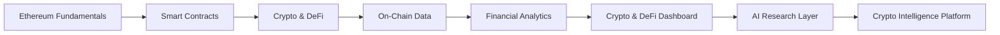

# shoBITCOIN

A hands-on Web3 learning project exploring **Ethereum, crypto, DeFi, financial analytics, data analysis, and AI**.

The project started as a simple smart contract and token experiment and will gradually evolve into an **AI-powered Crypto & DeFi Intelligence Platform**.

---

## 🎯 Project Goals

* Learn how Ethereum and blockchain networks work in practice
* Build and interact with smart contracts using Solidity
* Understand wallets, transactions, gas, and blockchain explorers
* Understand cryptocurrency and DeFi fundamentals
* Explore tokenomics, stablecoins, liquidity, lending, staking, and decentralized exchanges
* Collect and analyze crypto and on-chain data using SQL and analytics tools
* Build financial and DeFi analytics dashboards
* Develop an AI-powered crypto research and analysis layer
* Combine **blockchain + finance + analytics + AI** into one practical portfolio project

---

## 🗺️ Project Roadmap

---

## 📌 Current Status

### 🟢 Step 1 — Wallet & Testnet Setup: Completed

* Created a MetaMask wallet
* Secured the Secret Recovery Phrase offline
* Enabled the Ethereum Sepolia test network
* Obtained Sepolia test ETH through a testnet faucet
* Confirmed a Sepolia ETH balance
* Created this GitHub repository

### 🟢 Step 2 — Build the shoBITCOIN Smart Contract: Completed

* Created an ERC-20 token smart contract using Solidity
* Compiled the contract using Remix
* Created a total supply of **1,000,000 SHOBIT**
* Deployed the contract to the Ethereum Sepolia test network
* Interacted with contract functions
* Checked the token balance
* Verified the contract and token using a blockchain explorer

### 🔲 Step 3 — Execute the First shoBITCOIN Transfer

* Send SHOBIT between wallets
* Understand transaction confirmation
* Explore transaction fees and gas
* Verify the transaction on the blockchain

### 🔲 Step 4 — Learn Crypto & DeFi Fundamentals

* Bitcoin vs Ethereum
* Stablecoins
* Decentralized exchanges
* Liquidity
* Lending and borrowing
* Staking
* Tokenomics
* Protocol fees and revenue
* Total Value Locked (TVL)
* DeFi risks

### 🔲 Step 5 — Collect & Analyze Crypto / On-Chain Data

* Token prices
* Market capitalization
* Trading volume
* TVL
* Protocol fees and revenue
* Transactions
* Wallet activity
* Token holders
* Token distribution

### 🔲 Step 6 — Build Crypto & DeFi Analytics

* SQL-based analysis
* Financial KPIs
* Token and protocol analysis
* Wallet and transaction analysis
* Risk indicators
* Historical trend analysis

### 🔲 Step 7 — Build Crypto & DeFi Analytics Dashboard

* Market performance
* Protocol performance
* Tokenomics
* Liquidity
* Financial metrics
* Risk metrics
* Interactive visualizations

### 🔲 Step 8 — Build AI Crypto Research Layer

* AI-powered financial analysis
* Natural-language data exploration
* Protocol research summaries
* AI-assisted risk analysis
* Protocol comparisons
* Intelligent insights from structured data

---

## 🧩 Technology Stack

### Blockchain

* Ethereum
* Sepolia Testnet
* MetaMask
* Etherscan

### Smart Contracts

* Solidity
* ERC-20
* Remix

### Analytics

* SQL
* Power BI
* Financial Analysis
* On-chain / Blockchain Data

### AI

* Generative AI
* AI-assisted Financial Analysis
* Natural-language Data Exploration
* AI Research Agents
* Intelligent Insights

---

## 🔭 Long-Term Vision

The goal is to build an **AI-powered Crypto & DeFi Intelligence Platform** that combines:

> **Blockchain → Data → Finance → Analytics → AI**

The platform will eventually allow users to explore crypto assets and DeFi protocols through structured data, financial metrics, dashboards, and AI-generated research insights.

---

## 📚 Learning Approach

This project is being developed incrementally:

**Learn → Build → Analyze → Document → Repeat**

Each major stage will be documented through GitHub commits, technical notes, and project updates.

---

## ⚠️ Disclaimer

shoBITCOIN is an educational and experimental project.

The current SHOBIT token is deployed on the **Ethereum Sepolia test network** and is not intended as a financial product or investment.
